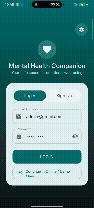

# Mental Health Companion

A comprehensive, full-stack mental health support application designed to provide emotional guidance, mood tracking, relaxation utilities, and crisis support.

> 🔄 **Migration Note**: This repository is the modern **Native Android (Kotlin + Jetpack Compose)** re-implementation of the original Flutter project: [abibinu/MENTAL_HEALTH_APP](https://github.com/abibinu/MENTAL_HEALTH_APP).

---

## 📱 App Demo Preview

<p align="center">
  
</p>

---

## 🌟 Project Overview
In today’s fast-paced world, stress, anxiety, and mental health challenges have become increasingly prevalent. The **Mental Health Companion** is designed to serve as a secure, personal space for users to monitor their emotional well-being. By combining modern Native Android application design (Kotlin + Jetpack Compose) with secure backend microservices (Node.js/Express) and relational database persistence (PostgreSQL), the app offers a variety of tools to guide users toward better mental health.

---

## 🚀 Core Features

### 1. 🤖 Dual-Language AI Virtual Therapist
* **Bilingual Emotional Support:** Integrated with **Groq AI (Llama-3.3-70B)** and **Google Gemini** APIs to act as a virtual therapist in both **English** and **Malayalam (`മലയാളം`)**.
* **Context-Aware Conversations:** Personalized greeting based on the user's registered name and a warm, empathetic therapy-focused prompting style.
* **Persistent Logs:** All chat histories are securely logged on the PostgreSQL server for reference.

### 2. 📊 Mood Tracker & Interactive Analytics
* **Daily Mood Logging:** Users select from 6 emotional states (Happy 😄, Calm 😌, Anxious 😟, Sad 😢, Angry 😠, Energetic ⚡) and append a personal note.
* **Data Visualization:** Custom Compose Canvas Donut Chart highlighting emotional distribution percentages and breakdown trends.

### 3. 🎵 Calm Sounds Hub
* **Audio Streaming:** Calming soundscapes categorized into nature sounds (Gentle Rain 🌧️, Ocean Waves 🌊, Stream Water 💧, Calm Forest 🌲) and acoustic melodies (Soft Piano 🎹, Meditation Chimes 🔔, Focus Frequencies 🎧).
* **Background Playback & Visualizer:** Seamless background audio streaming with an animated equalizer waveform visualizer.

### 4. 🧘 Relaxation Exercise: "Calm Tap"
* **Mindfulness Breathing Utility:** An interactive 3-2-3 rhythm exercise where a circle smoothly expands (Inhale 3s), holds (Hold 2s), and contracts (Exhale 3s).
* **Interactive Focus Beat:** Users tap the expanding sphere to synchronize breathing and record mindfulness score points.

### 5. 🆘 Emergency Help Center
* **24/7 National Helplines:** Direct access to major Indian crisis helplines (Snehi, AASRA, Kiran, Tele-MANAS, iCall, Vandrevala Foundation).
* **One-Tap Quick Actions:** SOS 112 emergency banner with one-tap phone dialer (`Intent.ACTION_DIAL`) and SMS triggers.
* **Custom Emergency Contacts:** Users can add and manage trusted family, friends, or therapist contacts.

### 6. 📝 Habit & Daily Task Planner
* **Daily Checklists:** An interactive task dashboard to complete daily micro-habits (drinking water, mindful walk, gratitude journaling).
* **Gamified Achievements:** Unlocks dynamic badges (🌟 *First Step*, 🎯 *Halfway There*, 🏆 *Goal Master*, ✨ *Mindfulness Star*).

---

## 🛠️ Tech Stack

| Layer | Technology | Key Packages / Libraries |
| :--- | :--- | :--- |
| **Frontend** | **Native Android (Kotlin)** | `Jetpack Compose`, `Material3`, `Retrofit2`, `OkHttp3`, `Coroutines`, `ExoPlayer/MediaPlayer` |
| **Backend** | **Node.js (Express)** | `express`, `bcrypt`, `cors`, `pg` (PostgreSQL client), `axios` |
| **Database** | **PostgreSQL** | Relational queries, foreign keys, cascade deletes |
| **AI Engine** | **Groq API / Gemini API** | `llama-3.3-70b-versatile` & `gemini-1.5-flash` models for conversational NLP |

---

## 🏗️ System Architecture

The project employs a robust **Client-Server Architecture** utilizing HTTP REST APIs for communication.

* **Client Layer:** Native Kotlin Android App (Jetpack Compose UI)
* **Backend Layer:** Express.js REST API Server
* **Database Layer:** PostgreSQL Relational Database
* **External APIs:** Groq API (Llama-3.3-70B) & Google Gemini API for NLP chatbot interactions

---

## 📊 Database Schema

Run the following SQL commands to initialize the PostgreSQL database schema for the application:

```sql
-- 1. Create Users Table
CREATE TABLE users (
    user_id SERIAL PRIMARY KEY,
    name VARCHAR(100) NOT NULL,
    email VARCHAR(100) UNIQUE NOT NULL,
    password_hash VARCHAR(255) NOT NULL,
    created_at TIMESTAMP DEFAULT NOW()
);

-- 2. Create Mood Logs Table
CREATE TABLE mood_logs (
    log_id SERIAL PRIMARY KEY,
    user_id INT REFERENCES users(user_id) ON DELETE CASCADE,
    mood VARCHAR(50) NOT NULL,
    note TEXT,
    logged_at TIMESTAMP DEFAULT NOW()
);

-- 3. Create Chat Logs Table
CREATE TABLE chat_logs (
    log_id SERIAL PRIMARY KEY,
    user_id INT REFERENCES users(user_id) ON DELETE CASCADE,
    message TEXT NOT NULL,
    response TEXT NOT NULL,
    created_at TIMESTAMP DEFAULT NOW()
);
```

---

## ⚡ Getting Started

### 🖥️ Backend Setup
1. Navigate to the backend directory:
   ```bash
   cd BACKEND
   ```
2. Install dependencies:
   ```bash
   npm install
   ```
3. Configure your environment variables. Create a `.env` file in the `BACKEND` directory:
   ```env
   DB_HOST=localhost
   DB_USER=your_postgres_username
   DB_PASSWORD=your_postgres_password
   DB_NAME=mental_health_app
   DB_PORT=5432
   GROQ_API_KEY=your_groq_api_key
   GEMINI_API_KEY=your_gemini_api_key
   ```
4. Start the server using Nodemon (for hot reloading):
   ```bash
   npm start
   ```
   *The server runs by default on `http://localhost:5000`.*

---

### 📱 Frontend Setup (Native Kotlin Android CLI & USB Debugging)

This frontend is configured for building and deploying directly from the command line without requiring Android Studio.

#### Prerequisites
- **JDK 17** installed and configured in your environment.
- **Android SDK** with Platform Tools (`adb`).
- Physical Android phone with **USB Debugging** enabled in Developer Options.

#### Step 1: Connect Your Android Device via USB
1. Plug your Android device into your PC via USB.
2. Configure reverse port forwarding for local backend connection:
   ```bash
   adb reverse tcp:5000 tcp:5000
   ```
3. Verify ADB connection:
   ```bash
   adb devices
   ```

#### Step 2: Build & Install Debug APK via Command Line
1. Navigate to the frontend directory:
   ```bash
   cd FRONTEND
   ```
2. Build the debug APK using Gradle Wrapper:
   - **Windows (PowerShell/CMD):**
     ```powershell
     .\gradlew assembleDebug
     ```
   - **Linux / macOS:**
     ```bash
     ./gradlew assembleDebug
     ```

3. Install and run directly onto your connected phone:
   - **Windows (PowerShell/CMD):**
     ```powershell
     .\gradlew installDebug
     ```
   - **Linux / macOS:**
     ```bash
     ./gradlew installDebug
     ```

4. Alternatively, install the built APK using `adb`:
   ```bash
   adb install -r app/build/outputs/apk/debug/app-debug.apk
   ```

---

## 📁 Project Structure

```text
MHC-KOTLIN/
├── BACKEND/
│   ├── .env                  # Configuration variables
│   ├── db.js                 # PostgreSQL Pool connection initialization
│   ├── index.js              # Express core server and authentication endpoints
│   ├── chatbot.js            # Groq AI & Gemini API integration router
│   ├── moodLogs.js           # Mood tracking database transaction endpoints
│   └── package.json          # Node dependencies
├── FRONTEND/
│   ├── app/
│   │   ├── build.gradle.kts  # Application module configuration & dependencies
│   │   └── src/
│   │       └── main/
│   │           ├── AndroidManifest.xml
│   │           └── java/com/mhc/app/
│   │               ├── MainActivity.kt      # Main Compose Entry Point
│   │               ├── ui/                  # Compose UI Screens (Auth, Chat, Mood, Sounds, Tasks, Emergency, Relaxation)
│   │               └── data/                # Retrofit API Services & Data Models
│   ├── build.gradle.kts      # Top-level Gradle build file
│   ├── gradle.properties     # JVM & AndroidX properties
│   └── gradlew / gradlew.bat # Gradle Wrapper executables
├── mhc.gif                   # Screen Recording Demo Preview GIF
└── README.md
```

---

## 🔮 Future Enhancements
* **Appointment Booking:** Add scheduling modules for certified clinical psychologists and mental health counselors.
* **Sentiment Trend Alerts:** Automatic warning triggers to reach out to emergency contacts if logged mood trends decline consecutively for 7 days.
* **Offline Synchronization:** Local SQLite database support to sync local data seamlessly back to the main PostgreSQL server when network connectivity is restored.
* **Group Support Forums:** Secure, peer-to-peer anonymous community chatrooms.
